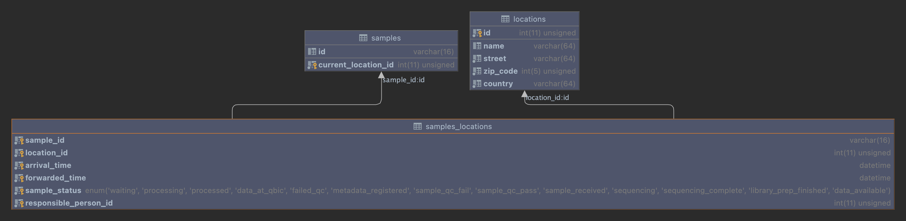
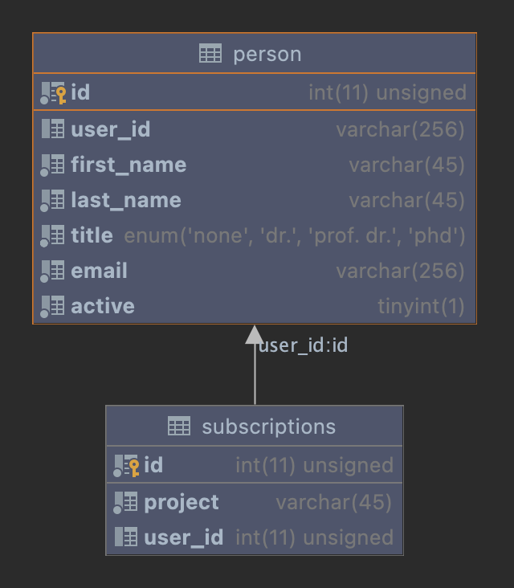

Sample Tracking Status Overview
-----------------------------------
Gives a visual overview of sample statuses

|maven-build| |maven-test| |codeql| |release|
|license| |java| |groovy|

How to run
----------------

First compile the project and build an executable java archive:

.. code-block:: bash

    mvn clean package

Note that you will need java 8.
The JAR file will be created in the /target folder:

.. code-block:: bash

    |-target
    |---sample-tracking-status-overview-1.0.0-SNAPSHOT.war
    |---...

The created war file can then be deployed on a portal system.

**Configuration**

.. list-table::

    * - **Environment**
      - **Description**
      - **Default Value**
    * - datasource.url
      - Connection to datasource
      - https://openbis.domain.de
    * - datasource.api.url =
      - Connection to API datasource
      - https://openbis.domain.de/api/path
    * - datasource.user
      - The user name for the datasource
      - myuser
    * - datasource.password
      - The password for the datasource
      - mypassword
    * - mysql.host
      - Host address for MySQL database
      - 123.4.56.789
    * - mysql.pass
      - Password for MySQL database
      - mypassword
    * - mysql.user
      - MySQL user
      - mysqluser
    * - mysql.db
      - MySQL database
      - my_sql_database_name
    * - mysql.port
      - Port to MySQL database
      - 3306
    * - portal.user
      - Username for QBiC portal
      - qbcjb02

Test environment
----------------

You can run the application in a ``testing`` mode:

.. code-block:: bash

  mvn clean jetty:run -Denvironment=testing -Demail=<email> -Dauth_id=<auth provider id> -Dfirst_name=<first name> -Dlast_name=<last name>

The email property is used to generate your portal-user id, the auth-id is the one that is provided by the authentication provider after successful login into the portal.
The first and last name as they are stored in the database need to be provided as well. As we run in test mode here, you need to simulate it with the properties.

Datastructures
--------------

To show the actual sample and project information, following entities need to be provided:
'ch.ethz.sis.openbis.generic.asapi.v3.dto.sample.Sample' (with code, properties and secondary name) and 'ch.ethz.sis.openbis.generic.asapi.v3.dto.project.Project' (with code, space code and description)

To find the status for each sample the table samples_locations is used

To associate to which projects a person is subscribed, the subscriptions table is used

License
-------

This work is licensed under the `MIT license <https://mit-license.org/>`_.

**Note**: This work uses the `Vaadin Framework <https://github.com/vaadin>`_, which is licensed under `Apache 2.0 <https://www.apache.org/licenses/LICENSE-2.0>`_.

.. |maven-build| image:: https://github.com/qbicsoftware/sample-tracking-status-overview/workflows/Build%20Maven%20Package/badge.svg
    :target: https://github.com/qbicsoftware/sample-tracking-status-overview/workflows/Build%20Maven%20Package/badge.svg
    :alt: Github Workflow Build Maven Package Status

.. |maven-test| image:: https://github.com/qbicsoftware/sample-tracking-status-overview/workflows/Run%20Maven%20Tests/badge.svg
    :target: https://github.com/qbicsoftware/sample-tracking-status-overview/workflows/Run%20Maven%20Tests/badge.svg
    :alt: Github Workflow Tests Status

.. |codeql| image:: https://github.com/qbicsoftware/sample-tracking-status-overview/workflows/CodeQL/badge.svg
    :target: https://github.com/qbicsoftware/sample-tracking-status-overview/workflows/CodeQL/badge.svg
    :alt: CodeQl Status

.. |license| image:: https://img.shields.io/github/license/qbicsoftware/sample-tracking-status-overview
    :target: https://img.shields.io/github/license/qbicsoftware/sample-tracking-status-overview
    :alt: Project Licence

.. |release| image:: https://img.shields.io/github/v/release/qbicsoftware/sample-tracking-status-overview.svg?include_prereleases
    :target: https://github.com/qbicsoftware/sample-tracking-status-overview/release
    :alt: Release status

.. |java| image:: https://img.shields.io/badge/language-java-blue.svg
    :alt: Written in Java

.. |groovy| image:: https://img.shields.io/badge/language-groovy-blue.svg
    :alt: Written in Groovy
